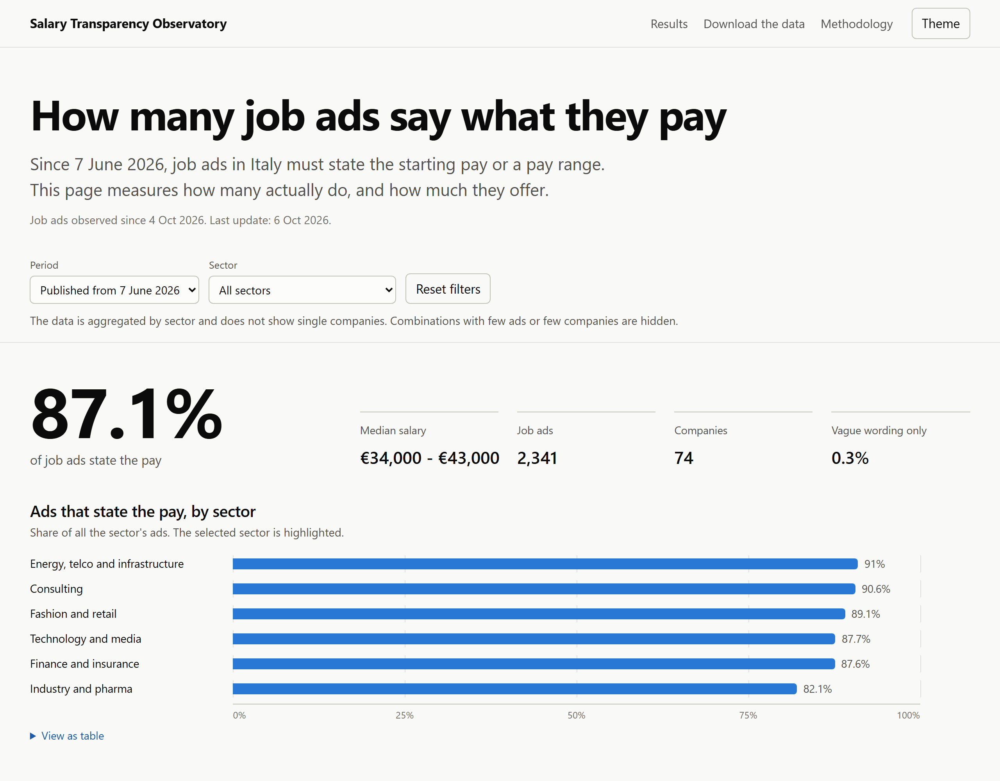
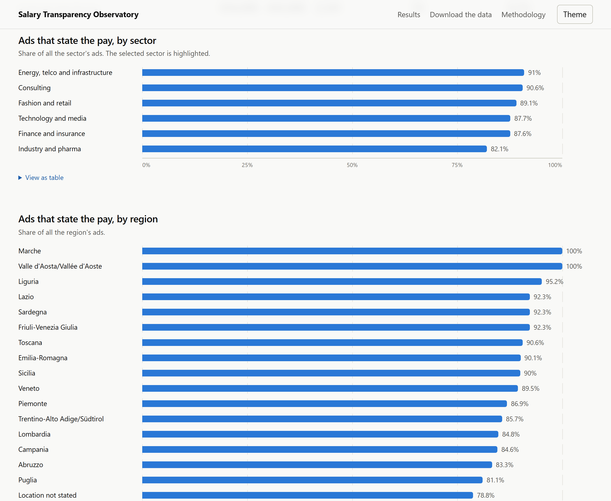
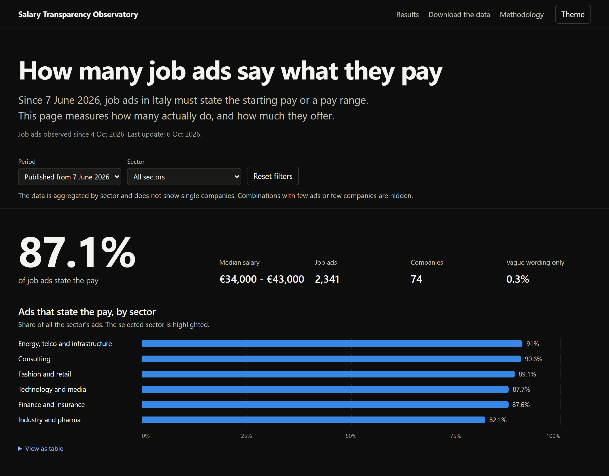
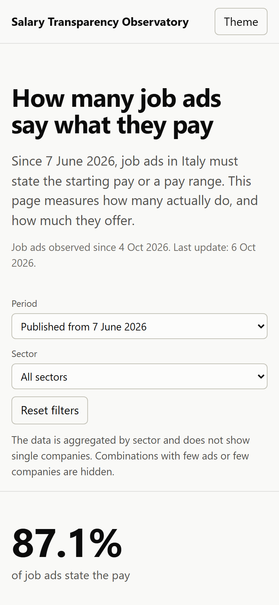

# Salary transparency in Italian job ads

Since 7 June 2026, Legislative Decree 96/2026 requires anyone who publishes a job ad in Italy to state the starting pay or a pay range. This project measures how well the rule is followed. It collects the ads published on the career sites of large companies hiring in Italy and counts how many give a figure, how many only use phrases like "pay commensurate with experience", and what salaries are offered by sector, function, seniority and region.

Collection started on 4 October 2026. As of 6 October: 290 companies analyzed, 76 with ads collected, about 2,900 ads in Italy. The results are published on a [web page](https://sollaigab.github.io/Salary_Compliance/) with data aggregated by sector, which does not allow anyone to trace them back to single companies.

## What the page shows

The page is online at https://sollaigab.github.io/Salary_Compliance/. Its source is in `webapp/`, and it shows the share of ads that state the pay, the median salary, and a comparison between ads published before and after the law came into force. The data can be filtered by period and sector, and downloaded as CSV (`webapp/data/aggregates.csv`).





The page follows the device's light or dark theme and works on phones.

<p>
  
  
</p>

## How the data is collected

The work has three steps.

1. For each company on a private list of large employers in Italy, `discover_ats.py` finds the applicant tracking system (ATS) that hosts its ads. It looks for traces of the ATS on the career page, with a headless browser for pages built in JavaScript, and tries the most likely company names on the public APIs.
2. `crawl_jobs.py` downloads the ads, keeps those located in Italy or remote, and classifies them: ISTAT municipality of the location, function, seniority, contract type, workplace type and pay.
3. `export.py` computes the aggregates published on the page, applying the protection rules described below.

Only public sources are used, with no login:

| ATS | Source |
|---|---|
| Greenhouse, Lever, Ashby, Workable, Recruitee | public job board APIs documented by the vendor |
| Personio | XML job feed |
| Workday, Oracle Recruiting | JSON endpoint used by the career page |
| Teamtailor | RSS feed of the career site |
| SuccessFactors | career site sitemap and the schema.org/JobPosting data of each ad |

Other ATSs have no public feed (Taleo, inRecruiting, Avature, Altamira, Phenom, Eightfold, iCIMS, Cornerstone, SuccessFactors without a sitemap), so the companies that use them are left out. SmartRecruiters has a public API, but its `robots.txt` disallows automated access, so it is not used.

## Collection rules

Every request goes through `lib/http.py`, which:

- follows the `robots.txt` of every site, APIs included;
- respects text and data mining opt-outs (art. 70-quater of Italian Law 633/1941, which implements EU Directive 2019/790), declared through `/.well-known/tdmrep.json` or the `tdm-reservation` header;
- waits 1 second between two requests to the same company site and about 0.35 seconds between two calls to the same API;
- stops contacting a service that answers with a 429 error and asks for a long pause, until the time it gives.

The ad text stays private and is not republished. Email addresses and phone numbers in the descriptions are deleted before saving.

## How an ad is classified

### Pay

If the ATS has a dedicated pay field, that field is used. Otherwise the figure is looked for in the text with the rules in `lib/salary.py`. Each ad falls into one of three classes: it gives a figure, it only uses vague wording, or it says nothing.

Figures are converted to gross annual salary in euros. In Italy annual pay is usually spread over 14 monthly payments, so monthly amounts are multiplied by 14, or by 12 for internships. Hourly or daily pay, net figures and figures in other currencies count as "states the pay" but are not part of the salary medians. An annual value below €5,000 or above €500,000 is discarded, because it is usually another amount, such as an allowance or the company's revenue.

### Seniority

The level is read from the ad title ("Senior", "Junior", "Head of"). When the title does not say, it is derived from the years of experience the text asks for: under 2 years is junior, 2 to 4 is mid-level, 5 or more is senior. About one ad in three states neither the level nor the years of experience.

### Publication date

Ads published from 7 June 2026 fall under the law and form the base of the main analysis. Those published in the previous 12 months are used only for comparison. Those online for more than a year are usually evergreen positions and are kept separate.

## Protecting the companies

The public page contains no single ads, and no company names, titles or links. The data is aggregated by macro-sector, and each macro-sector includes at least 3 companies. The rules are in `lib/disclosure.py`:

- a combination (for example "Finance and insurance, Lombardia") appears only if it covers at least 5 ads from at least 3 companies;
- no company can have more than 70% of the combination's ads, otherwise the figure would in practice describe that company;
- salary medians follow the same thresholds;
- if only one combination in a group is hidden, the smallest of the others is hidden too, so it cannot be worked out by subtracting from the total.

With the October 2026 data these rules hide about 320 of 780 combinations.

## Limits

- Collection started on 4 October 2026 and only sees the ads online from that day. Ads published before the law and still online do not represent the market of that time.
- The publication date means slightly different things across ATSs: sometimes it is the first publication, sometimes a repost or the latest update.
- The results describe the 76 companies with ads collected, not the whole Italian job market. Companies whose ATS has no public source are excluded.
- Pay and seniority are extracted with automatic rules. Their accuracy is measured on a sample of ads checked by hand with `validate_salary.py`.

## How it was built

I built the project with the help of Claude Code, Anthropic's coding assistant. The method, the sources and the choices about publishing the data are mine, and I checked the results by hand. `prompt_claude_code.md` is the brief I started from, translated into English.

## Structure

```
discover_ats.py          finds the applicant tracking system of each company
crawl_jobs.py            downloads and classifies the job ads
export.py                public aggregates and DuckDB or BigQuery export
search.py                search in the stored ads
validate_salary.py       manual check of the pay extraction
lib/                     HTTP requests, ATSs, locations, classification, protection rules
sql/                     database schema and views
scripts/                 scheduled update on Windows
webapp/                  web page and aggregate data
data/reference/          ISTAT list of Italian municipalities and population
tests/                   tests
```

The company list, the ATS registry and the database of ads stay private and are not in this repository.

## Reference data sources

- ISTAT, list of Italian municipalities, CC BY 4.0 license (`data/reference/comuni_istat.csv`)
- comuni-json by Matteo Contrini, MIT license, for municipality population (`data/reference/comuni_popolazione.json`)

## License

The code is released under the MIT license (`LICENSE` file). The aggregate data in `webapp/data/` is released under the Creative Commons Attribution 4.0 International license (CC BY 4.0): you can reuse it with attribution. The reference data in `data/reference/` keeps the original licenses listed above.

This README is not legal advice.
